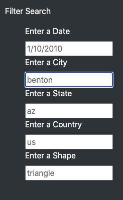
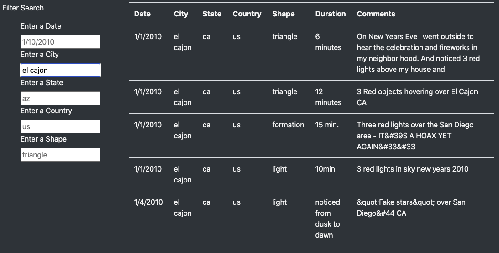
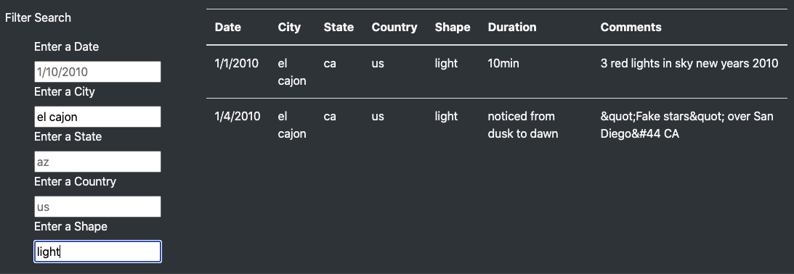

# UFOs
Module 11 - JavaScript

## **Overview of Project**

The purpose of this project is to help Dana update her article's website and provide users with an ability to filter by multiple UFO sighting criteria based on the data set provided. We added the ability to filter for sightings by city, state, country, and shape as well as date.

## **Results**

We were successfully able to add the ability to use multiple filters on the dataset using javascript and linking it to our index.html page.

## How to Operate

The UFO Sightings table has a Filter Search panel to the left of the page. Using this panel Dana (and others!) can look up sightings based on one or more criteria.

</img>

To use the UFO sightings table to look up light based UFO sightings from El Cajon, California for example; Dana can type "el cajon" into the "Enter a City" field of the search.

Below are the results of the search. The table returns five different sightings and the details accompanying them:

</img>

If we were to refine our search to only view the results of "light-shaped" UFO appearances in El Cajon, we can add a further "light" filter to the "Enter a Shape" field.

</img>

This yields the details of the further refined search of light-shaped UFO sightings in El Cajon, California.

To clear the search and return to the original table of data, one just needs to delete their input in the fields.

## **Summary**
In conclusion we are able to filter the UFO sightings dataset by multiple filters. The data can now be filtered via Date, City, State, Country, or UFO Shape.

One drawback of this design is that the user needs to input the data exactly how it is read in the data file, meaning that it must be entered in lower case which is not the norm for state, city and country names. Removing case sensitivity and cleaning the source data could help remedy this issue as well as improve the esthetics of the page.

Alternately adding an autofill drop down menu for the input fields would also remedy the user search drawback. This would help users know if what they are looking for is listed and what their options are regarding the "shape" filter.

In addition, two recommendations for further development of this website are:

1. To return a message if no results are found or input is entered incorrectly. At the moment, an empty table is displayed.
2. Adding a "clear filters" button to save users the extra clicks of deleting all their input individually.

